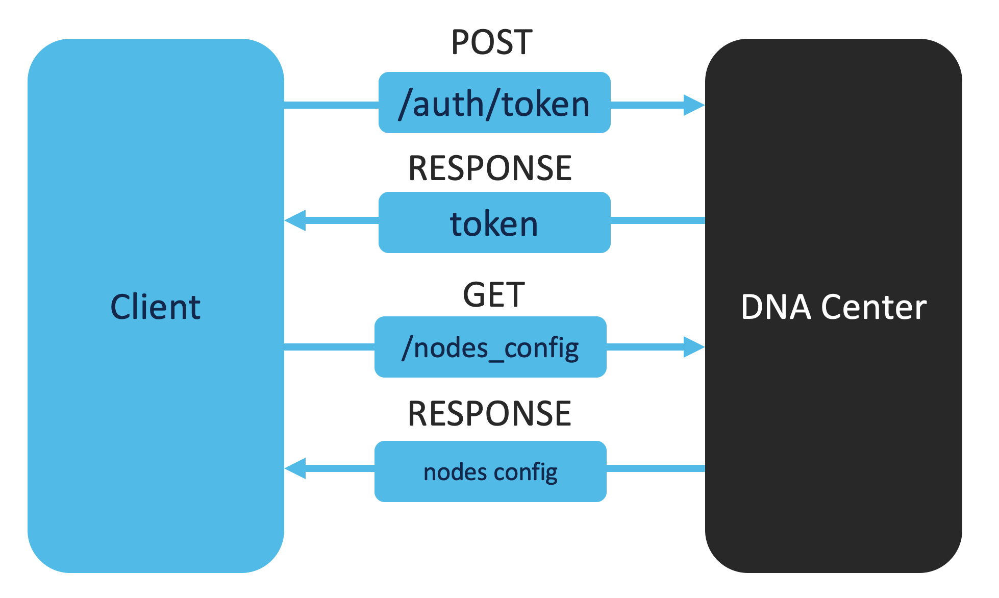

# NTP Server Verification
Network Time Protocol (NTP) allows us to synchronize the clocks within a network. Synchronized clocks are crucial for distributed systems. Therefore, it is important that we verify the configuration of the NTP server. 

In this section, we will explore how to perform an NTP server verification on the DNA Center through its API. The NTP server verification using the DNAC API happens in three steps:

1. Obtain a DNAC authentication token
2. Get the nodes configuration details and filter out the current NTP server configuration
3. For each node, compare the current NTP server configuration with the golden configuration



## Usage

Please enter the following commands in the terminal:

0. Change to the current directory (you current directory should be `0_dns_server_verification`):

        $ cd ../1_ntp_server_verification

1. Obtain the DNAC authentication token. Uncomment the following code block in `main.py`:

    ```python
    # # Step 1: Uncomment the following code block
    # # Obtain DNA Center authentication token
    # token = get_auth_token()
    # print("You DNAC token: ", token)
    ```
    And execute the following code in your terminal:

        $ python main.py
    
    You should see your DNAC token displayed in the terminal now.

2. Get the NTP server details by making a call to the `/dna/intent/api/v1/nodes-config` endpoint. Uncomment the following code block in `main.py`:

    ```python
    # # Step 2: Uncomment the following code block
    # # Obtain the NTP server details
    # nodes_config_details = get_nodes_config(token)
    # print(json.dumps(nodes_config_details, indent=2))
    ```
    And execute the following code in your terminal:

        $ python main.py
    
    You should see the nodes configuration summary displayed in the terminal now.

3. Add the golden configuration of the NTP server and compare the golden configuration with the current configuration of the NTP server. The configurations are compared for each node and saved in a list called `results`. A small table is created showcasing the results of the verification. Uncomment the following code block in `main.py`:

    ```python
    # # Step 3: Uncomment the following code block
    # results = []
    # # In case you have a multi node DNA Center deployment
    # for node in nodes_config_details["nodes"]:
    #     node_name = node["name"]
    #     ntp_server_details = node["ntp"]["servers"]

    #     #####################
    #     ##  Golden Config  ##
    #     #####################

    #     ## Insert golden config of ntp server
    #     ## Below is just an example
    #     golden_config_ntp_server = "10.10.10.10"

    #     #####################

    #     correct_ntp_server = False
    #     # Verify the NTP server
    #     if golden_config_ntp_server in ntp_server_details:
    #         correct_ntp_server = True
        
    #     results.append([node_name, ntp_server_details, golden_config_ntp_server, correct_ntp_server])

    # print(' ')
    # print('The results of the NTP server verification:')
    # print(' ')
    # # Print a table of the output
    # print(tabulate(results, headers=['Name of node', 'NTP server config', 'NTP server golden config', 'Correct NTP server Config?']))
    ```

    And execute the following code in your terminal:

        $ python main.py
    
    You should see the results of the NTP server verification displayed in the terminal now.

4. Great job! You have successfully performed a basic NTP server verification. Customize the code if needed to suit your use case. Click on `next` for the next use case. 


<div align="right">

   [Prev](../0_dns_server_verification) - [Next](../2_interfaces_verification)
</div>
