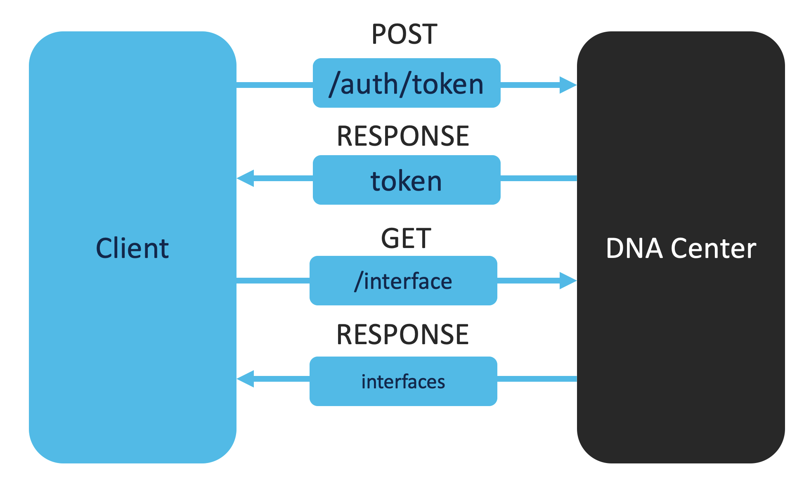

# Interfaces Verification

In a large and complex network, the number of switches can quickly grow to more than 1000 switches and the number of interfaces can quickly grow to more than 20.000 interfaces. Interfaces can be misused and, therefore, it is crucial that we monitor the interfaces and that the interfaces are configured correctly.  

In this section, we explore how we can verify the interfaces in a network through the DNA Center API. The interfaces verification will be performed in three steps: 

1. Obtain a DNAC authentication token
2. Get the interfaces
3. In this use case, we would like to have every interface status to be up. For each interface, we verify that the status is up. In case it is not, it will be added to a list and this list will be reported separately. 



## Usage

Please enter the following commands in the terminal:

0. Change to the current directory (you current directory should be `1_ntp_server_verification`):

        $ cd ../2_interfaces_verification

1. Obtain the DNAC authentication token. Uncomment the following code block in `main.py`:

    ```python
    # # Step 1: Uncomment the following code block
    # # Obtain DNA Center authentication token
    # token = get_auth_token()
    # print("You DNAC token: ", token)
    ```
    And execute the following code in your terminal:

        $ python main.py
    
    You should see your DNAC token displayed in the terminal now.

2. Obtain all the interfaces. Note that the API only returns a maximum of 500 interfaces per response. Uncomment the following code block in `main.py`:

    ```python
    # # Step 2: Uncomment the following code block
    # # Obtain the interfaces
    # interfaces = get_all_interfaces(token)
    # print(json.dumps(interfaces, indent=2))
    ```
    
    And execute the following code in your terminal:

        $ python main.py
    
    You should see all the interface details displayed in the terminal now.

3. Loop through the list of interface details and verify that each interface is up. In case it is not up, then add the details to a list of `down_interfaces`. Uncomment the following code block in `main.py`:

    ```python
    # # Step 3: Uncomment the following code block
    # # Verify the interfaces
    # # Example: verify that all the interfaces are UP
    # results = []
    # down_interfaces = []
    # for interface in interfaces:
    #     is_status_up = False
    #     device_id = interface['deviceId']
    #     port_name = interface['portName']
    #     admin_status = interface['adminStatus']

    #     # Insert desired config
    #     # Below is just an example
    #     if admin_status == "UP":
    #         is_status_up = True
    #     results.append([device_id, port_name, admin_status, is_status_up])

    #     if not is_status_up:
    #         down_interfaces.append([device_id, port_name, admin_status, is_status_up])

    # print(' ')
    # print('The results of the interfaces verification:')
    # print(' ')
    # # Print a table of the output
    # print(tabulate(results, headers=['Device ID', 'Interface Name', 'Status', 'Is status up?']))
    # print(' ')
    # print('The results of the interfaces verification:')
    # print(' ')
    # # Print a table of the interfaces that are down
    # print(tabulate(down_interfaces, headers=['Device ID', 'Interface Name', 'Status', 'Is status up?']))
    # print(' ')
    ```
    And execute the following code in your terminal:

        $ python main.py

    You should see the results of the NTP server verification displayed in the terminal now.

4. Great job! You have successfully performed a basic interfaces verification. Customize the code if needed to suit your use case. Click on `next` for the next use case. 


<div align="right">

   [Prev](../1_ntp_server_verification) - [Next](../3_vty_lines_verification)
</div>

