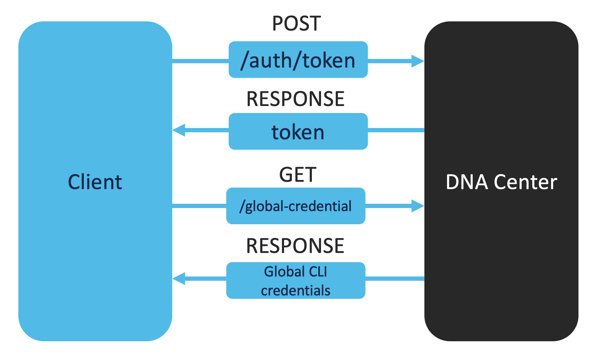

# VTY Lines Verification
In the current threat landscape, it is important that all of our devices are secure and safe. We need to make sure that the credentials are correct.

In this section, we explore how we can verify vty lines through the DNA Center API. The vty lines verification will be performed in three steps: 

1. Obtain a DNAC authentication token
2. Get the global credentials for CLI
3. In this use case, we would like to have every interface status to be up. For each interface, we verify that the status is up. In case it is not, it will be added to a list and this list will be reported separately. 



## Usage

Please enter the following commands in the terminal:

0. Change to the current directory (you current directory should be `2_interfaces_verification`):

        $ cd ../3_vty_lines_verification

1. Obtain the DNAC authentication token. Uncomment the following code block in `main.py`:

    ```python
    # # Step 1: Uncomment the following code block
    # # Obtain DNA Center authentication token
    # token = get_auth_token()
    # print("You DNAC token: ", token)
    ```
    And execute the following code in your terminal:

        $ python main.py
    
    You should see your DNAC token displayed in the terminal now.

2. Obtain the global CLI credentials. Uncomment the following code block in `main.py`:

    ```python
    # # Step 2: Uncomment the following code block
    # # Specify the credentials subtype as a parameter
    # query_string_params = {
    #     'credentialSubType' : 'CLI'
    # }

    # # Obtain the CLI credentials
    # credentials = get_credentials(token, query_string_params)
    # print(json.dumps(credentials, indent=2))
    ```

    And execute the following code in your terminal:

        $ python main.py
    
    You will see a JSON object with the CLI credentials displayed in the terminal now.

3. Add the golden configuration of the credentials, i.e., what was the intended username and password. Uncomment the following code block in `main.py`:

    ```python
    # # Step 3: Uncomment the following code block
    # #####################
    # ##  Golden Config  ##
    # #####################

    # # Verify the credentials/vty lines configuration
    # # Insert the golden configuration
    # # Below is just an example
    # golden_config_credential = {
    #     'username': 'example',
    #     'password': 'example'
    # }

    # #####################
    ```
4. For each credential in the list of `credentials`, we check if the current configuration corresponds with the golden configuration. Uncomment the following code block in `main.py`:

    ```python
    # # Step 4: Uncomment the following code block
    # for credential in credentials:
    #     # We check if the golden_config_credential is a subset of the credential dictionary
    #     is_golden_config_in_credential = all(item in credential.items() for item in golden_config_credential.items())
    #     print("Is the golden config a subset of the credential dictionary? ", is_golden_config_in_credential)
    ```

    And execute the following code in your terminal:

        $ python main.py
    
    You will see a report with the results of the vty lines verification displayed in the terminal now.

5.  Great job! You have successfully performed a basic interfaces verification. Customize the code if needed to suit your use case. Click on `next` for the next use case. 

<div align="right">

   [Prev](../2_interfaces_verification) - [Next](../4_vrf_verification)
</div>
