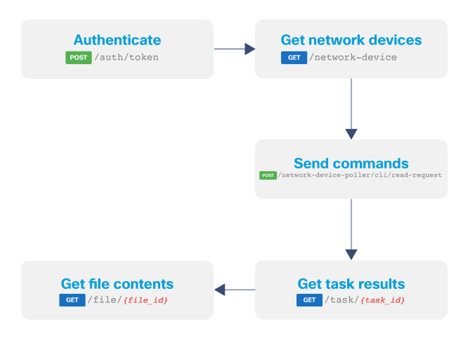

# VRF Verification
Virtual Routing and Forwarding (VRF) is a technology that allows us to increase connectivity by creating segmented network paths and automatically segregating traffic. It is a crucial technology for the DNA Center and, therefore, we have to make sure that the VRF is correctly configured. 

>Please note that this use case requires write access to the DNA Center. While the other use cases could be performed using the Always On DNA Center sandbox, this use case unfortunately needs either a [reserved DNA center sandbox](https://devnetsandbox.cisco.com/RM/Topology?c=14ec7ccf-2988-474e-a135-1e90b9bc6caf) or your own instance with write access. 

>Please update the `.env` file with credentials that write access to a DNAC instance. 

In this use case, we are going to explore how to perform a VRF verification using the DNAC API. This verification will take a few more steps than the other use cases, but it's a nice challenge and good to explore new API calls: 

1. Obtain a DNAC authentication token
2. Get the devices in your network and filter out the unwanted devices, e.g. WLC, etc. 
3. Send the commands to these devices by making a `post` request to the Command Runner API. In the payload, you specify the commands, device UUIDs and the timeout. 
4. The Command Runner API is an asynchronous API call, so you will obtain a task ID to check in on the progress. We let the program sleep for 30 seconds, so all the commands can be executed on the devices. In case you have more devices, then you might have to increase the sleep time. After the sleep time, obtain the file ID from the task API
5. Then, we download the file with the responses from each command.
6. After having obtained the file, we can extract the relevant content, i.e., the VRF configuration. We compare the current VRF configuration with the golden configuration. 



## Usage
Please enter the following commands in the terminal:

0. Change to the current directory (you current directory should be `3_vty_lines_verification`):

        $ cd ../4_vrf_verification

1. Obtain the DNAC authentication token. Uncomment the following code block in `main.py`:

    ```python
    # # Step 1: Uncomment the following code block
    # # Obtain DNA Center authentication token
    # token = get_auth_token()
    # print("You DNAC token: ", token)
    ```
    And execute the following code in your terminal:

        $ python main.py
    
    You should see your DNAC token displayed in the terminal now.

2. Obtain a filtered list of devices. In this use case, we filter out the Switches and Hubs. Uncomment the following code block in `main.py`:


    ```python
    # # Step 2: Uncomment the following code block
    # # Get a filtered list of devices
    # params_filter_devices = {"family": "Switches and Hubs"}
    # devices = get_device_list(token, params_filter_devices)
    # print(json.dumps(devices, indent=2))
    ```

    And execute the following code in your terminal:

        $ python main.py
    
    You should see a list of devices displayed in the terminal now.

3. Extract the device IDs. Uncomment the following code block in `main.py`:

    ```python
    # # Step 3: Uncomment the following code block
    # # Extract the device IDs of each device
    # device_ids = []
    # for device in devices:
    #     device_ids.append(device["id"])
    # print(device_ids)
    ```

    And execute the following code in your terminal:

        $ python main.py
    
    You should see a list of device IDs displayed in the terminal now.

4. Send the commands to the Command Runner API and obtain a `task_id`. Uncomment the following code block in `main.py`:


    ```python
    # # Step 4: Uncomment the following code block
    # # Send a number of commands to the command runner API
    # commands = [
    #         "show vrf"
    #     ]
    # payload = {
    #     "commands": commands,
    #     "deviceUuids": device_ids,
    #     "timeout": 0
    # }
    # task_id = post_command_runner_request(token, payload)
    # print(task_id)
    # 
    # # Let's wait 30 seconds after executing the commands
    # time.sleep(30)
    ```
    And execute the following code in your terminal:

        $ python main.py

   You will see a task ID displayed in the terminal now.

5. Obtain the file ID from the Task API and then download the file. Uncomment the following code block in `main.py`:

    ```python
    # # Step 5: Uncomment the following code block
    # # We use the task_id to obtain a file_id
    # file_id = get_file_id(token, task_id)

    # # Obtain a file using the file_id
    # file = get_file(token, file_id)
    # print(file)
    ```

    And execute the following code in your terminal:

        $ python main.py


   You will see the file with responses displayed in the terminal now.

6. For each device, we are going to filter out the successful responses, parse the output and compare the output with the golden config output. Then print out a table with the results of the VRF verification. Uncomment the following code block in `main.py`:

    ```python
        # # Step 6: Uncomment the following code block
    # results = []
    # for device in file:
    #     device_uuid = device['deviceUuid']
    #     for command in commands:
    #         if device['commandResponses']['SUCCESS']:
    #             # Print the raw output
    #             command_output = device['commandResponses']['SUCCESS'][command]
    #             print(command_output)
    #             print(' ')

    #             # Parse the raw output
    #             parser = GenieCommandParse(nos='ios')
    #             parsed_output = parser.parse_string(show_command=command, show_output_data=command_output)

    #             # Print the parsed output
    #             print(json.dumps(parsed_output, indent=2))
    #             print(' ')

    #             if command == "show vrf":

    #                 #####################
    #                 ##  Golden Config  ##
    #                 #####################

    #                 # Insert golden config of show vrf
    #                 # Below is just an example
    #                 golden_config_show_vrf = {
    #                     "vrf": {
    #                         "Mgmt-vrf": {
    #                         "protocols": [
    #                             "ipv4",
    #                             "ipv6"
    #                         ],
    #                         "interfaces": [
    #                             "GigabitEthernet0/0"
    #                         ]
    #                         }
    #                     }
    #                 }

    #                 #####################

    #                 # Verify if the vrf config is correct, by default false
    #                 correct_vrf_config = False
    #                 if golden_config_show_vrf == parsed_output:
    #                     correct_vrf_config = True
                    
    #                 # Add the result to the list of results
    #                 results.append([device_uuid, correct_vrf_config])

    # print(' ')
    # print('The results of the VRF verification:')
    # print(' ')
    # # Print a table of the output
    # print(tabulate(results, headers=['Device UUIDs', 'Correct VRF Config']))
    ```

    And execute the following code in your terminal:

        $ python main.py


   You will see the results of the VRF verification displayed in the terminal now.

7. Great job! You have successfully performed a basic VRF verification. Customize the code if needed to suit your use case. 

    Congratulations! You have reached the end of this workshop. If you are looking for further resources, then return to the main [README](../README.md). 

    <div align="right">

   [Prev](../3_vty_lines_verification)
</div>
